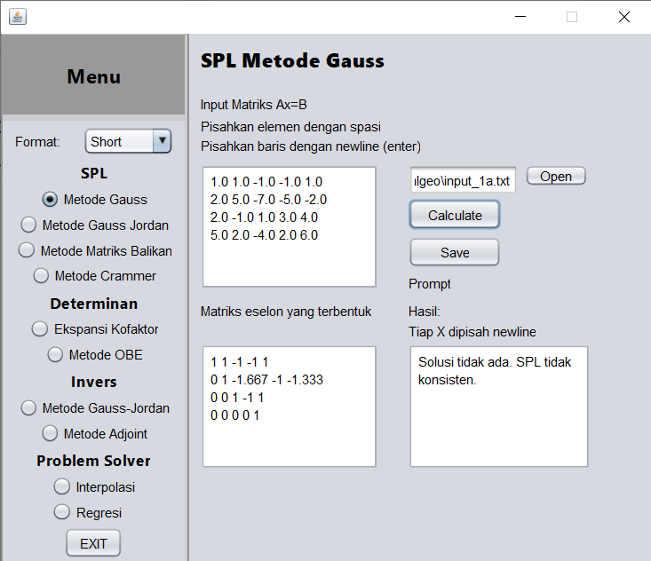

# Tugas Besar Algeo 1

> **Kelompok 42**  
> _(The Answer of Life)_  
> Rifqi Naufal Abdjul (13520062)  
> Amar Fadil (13520103)  
> Vito Ghifari (13520153)

## Table of Contents

- [General Information](#general-information)
- [Technologies Used](#technologies-used)
- [Features](#features)
- [Screenshots](#screenshots)
- [Setup](#setup)
- [Usage](#usage)
- [Project Status](#project-status)
- [Room for Improvement](#room-for-improvement)
- [Acknowledgements](#acknowledgements)
- [Contact](#contact)
<!-- * [License](#license) -->

## General Information

**Tugas Besar Algeo 1** merupakan project yang menggunakan bahasa pemrograman Java untuk menyelesaikan problem pada aljabar linier & geometris. Salah satu problem yang dapat diselesaikan dengan project ini adalah mencari solusi sistem persamaan linear. Proyek ini berbasis GUI dan mendukung file (.txt) sebagai input atau output. Pada utamanya, project ini ditujukan untuk memenuhi tujuan akademik.

## Technologies Used

- Java JDK 14.0.2
- Maven 3.2.0

## Features

Fitur yang kami implementasi dalam program ini seperti

- Penyelesaian perhitungan seperti SPL, determinan, dan invers
- Penyelesaian permasalahan seperti Regresi Linear dan Interpolasi polinom
- GUI yang mudah digunakan
- Formatting number agar lebih komprehensif sesuai kebutuhan
- I/O melalui file yang berisikan input atau output program

## Screenshots

<!-- If you have screenshots you'd like to share, include them here. -->

## Setup

Berikut cara penggunaan project kami dijelaskan per langkah

1. Clone repo menggunakan command berikut
   > `git clone`
2. Build Repo menggunakan maven untuk menghasilkan f older bin
   > `amar code plz`
3. Untuk menjalankan program, bisa jalankan .jar yang berada di bin atau gunakan command berikut untuk menjalankan dengan .class file
   > `java -cp libs/AbsoluteLayout.jar;classes alingeo.matriks.ui.Main`

## Usage

Dengan menjalankan program, akan memunculkan GUI yang komprehensif untuk digunakan, berikut ada beberapa contoh input untuk setiap modul

### SPL

Masukan berupa Augmented Matrix  
Khusus untuk metode crammer dan matriks balikan ukuran matriks harus sesuai (N x N+1)

> `1 2 3 4 5`  
> `2 2 3 4 5`  
> `3 3 3 4 5`  
> `4 4 4 4 5`

### Determinan

Masukan berupa Matriks persegi berukuran >= 2x2

> `1 2 3`  
> `4 5 6`  
> `7 8 9`

### Invers

Masukan berupa Matriks persegi berukuran >= 2x2

> `3 2 1`  
> `5 1 2`  
> `7 1 2`

### Interpolasi

Masukan N (jumlah points), Point, dan X yang ingin di prediksi

> `3` (N)  
> `1 2` (point)  
> `2 3` (point)  
> `4 5` (point)  
> `3` (X)

### Regresi

Masukan N (banyak suku), Persamaan linear ganda, dan Xk yang ingin di prediksi

> `3` (N)  
> `1 2 3 4` (Pers)  
> `6 1 2 9` (Pers)  
> `2 1 4 7` (Pers)  
> `5 2 1` (Xk)

## Project Status

Karena kami membuat project ini dengan niatan menyelesaikan tugas, **kami tidak akan melanjutkan project ini** selain terdapat potensi atau minat dari pihak luar.

## Room for Improvement

Dari kami, terdapat beberapa fitur yang seharusnya bisa dikembangkan, tetapi dikarenakan adanya _time constraint_ sehingga kita memutuskan untuk tidak mengembangkannya.  
FItur tersebut seperti:

- Pembentuk matriks augmented dari persamaan SPL
- Visualisasi/penggambaran proses pembentukan matriks eselon menggunakan OBE
- Penulisan persamaan menggunakan LaTeX
- Grafik interpolasi dan grafik regresi
- Batch input/output file txt

## Acknowledgements

Selama project, kami sangat terbantu dengan yang disebutkan di bawah ini.

- Amar Fadil, mengarahkan untuk melakukan best practice untuk menyusun kode.
- Stackoverflow, yang membantu men-debug code ketika kita membuat kesalahan.
- Pak Rinaldi Munir, sebagai dosen kami dalam matkul aljabar linier dan geometri yang mengajarkan kami konsep matematis program ini.

<!-- Optional -->
<!-- ## License -->
<!-- This project is open source and available under the [... License](). -->

<!-- You don't have to include all sections - just the one's relevant to your project -->
